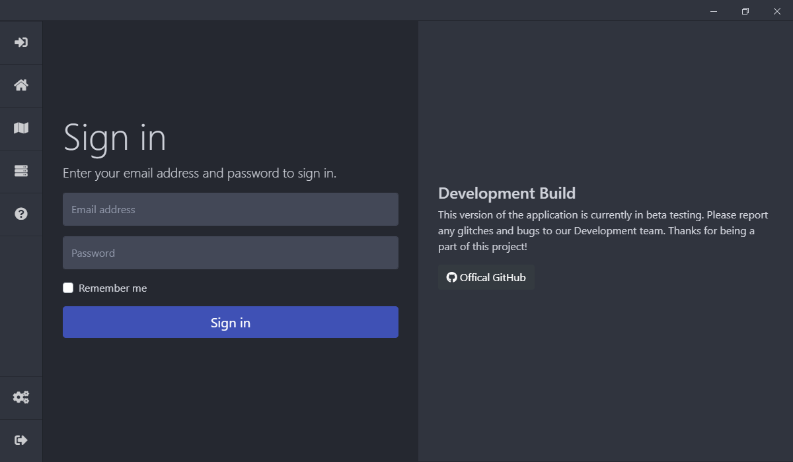

# Exordium
*A project by the Exordium Development Team.*

Exordium is a virtual private networking software in the works. **Our goal is to donate all profits made from the VPN towards environmental protection, and to fight against the climate crisis.** 

We hope to share as much of our programming as open source code to help others create their own projects and further the development of software built with `electronjs` and` nodejs`, which are the fundamental pieces to us. 

## 0.4.6

We are currently in the 0.4.* development versions of the Exordium application.

The current version of the Exordium project has come a long way and we will continue to build on and improve its features and design. Thanks to all those who have helped us build on the foundation.

### Features

- `electron-auto-updater`, automatically detects updates from this GitHub repository and downloads and installs them.
- `online/offline`, informs the user on whether their connected to the internet or not (kind of important being that the application is used to create that connection).
- `electron-theme-aware`, detect the system theme settings (works on Mac, and Windows (1903 or higher))
- `discord-rich-presence`, lets all your friends know that you're protected on Exordium.
- Amazing looking design using `bootstrap 4`, `animate.css`, and `font-awesome`.

## Issues and Suggestions

If you run into issues with our application or have suggestions towards features you think should be added, please feel free to either contact us or open an issue within this repository.

## Contact Us

If you need to get in contact with our development team or customer support, please either [join our discord server](https://discord.exordium.dev) or visit [our contact page on our website](https://exordium.dev/contact).

If you want to send us an email, regarding any issue, you can send an email to:
- :envelope: [contact@exordium.dev](mailto:contact@exordium.dev)

## Contributors

For a full list of contributors who have helped with this project, please checkout our [contributors file](docs/CONTRIBUTORS.md).
