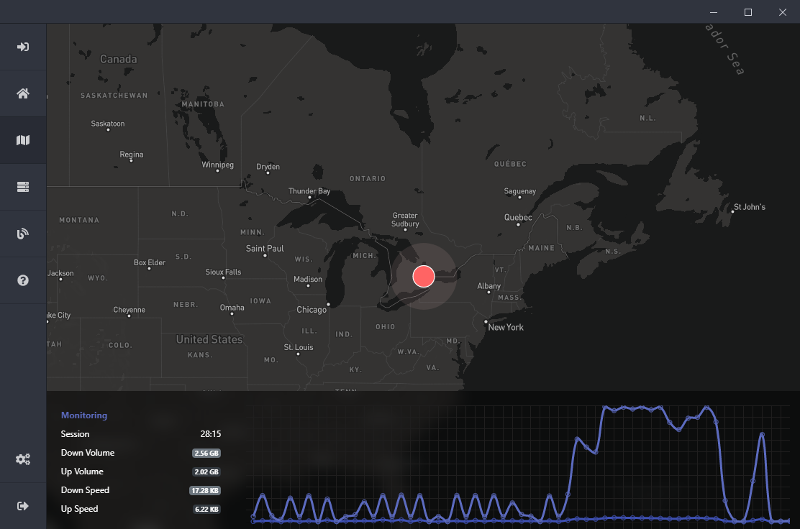

# Exordium
*A project by the Exordium Development Team.*

Exordium is a virtual private networking software in the works. **Our goal is to donate all profits made from the VPN towards environmental protection, and to fight against the climate crisis.** 

We hope to share as much of our programming as open source code to help others create their own projects and further the development of software built with `electronjs` and` nodejs`, which are the fundamental pieces to us. 

## 0.5.8

We are currently in the 0.5.* development versions of the Exordium application. Download the [latest release here](https://github.com/exordium-dev/exordium/releases/latest)!

The current version of the Exordium project has come a long way and we will continue to build on and improve its features and design. Thanks to all those who have helped us build on the foundation.

### Features

- `electron-auto-updater`, automatically detects updates from this GitHub repository and downloads and installs them.
- `online/offline`, informs the user on whether their connected to the internet or not (kind of important being that the application is used to create that connection).
- `electron-theme-aware`, detect the system theme settings (works on Mac, and Windows (1903 or higher))
- `discord-rich-presence`, lets all your friends know that you're protected on Exordium.
- Amazing looking design using `bootstrap 4`, `animate.css`, and `font-awesome`.

## Issues & Suggestions

If you run into an issues regarding the application, feel free to open [an issue](https://github.com/exordium-dev/exordium/issues) so we can work together and resolve it. You can also contact us through our [discord server](https://discord.exordium.dev/), or [emails](mailto:contact@exordium.dev).

## Contact Us

If you need to get in contact with our development team or customer support, please either [join our discord server](https://discord.exordium.dev) or visit [our contact page on our website](https://exordium.dev/contact).

If you want to send us an email, regarding any issue, you can send an email to:
- :envelope: [contact@exordium.dev](mailto:contact@exordium.dev)

## Contributors

The following contributors have either helped to start this project, have contributed
code, are actively maintaining it (including documentation), or in other ways
being awesome contributors to this project. **We'd like to take a moment to recognize them.**

The Exordium development team:

