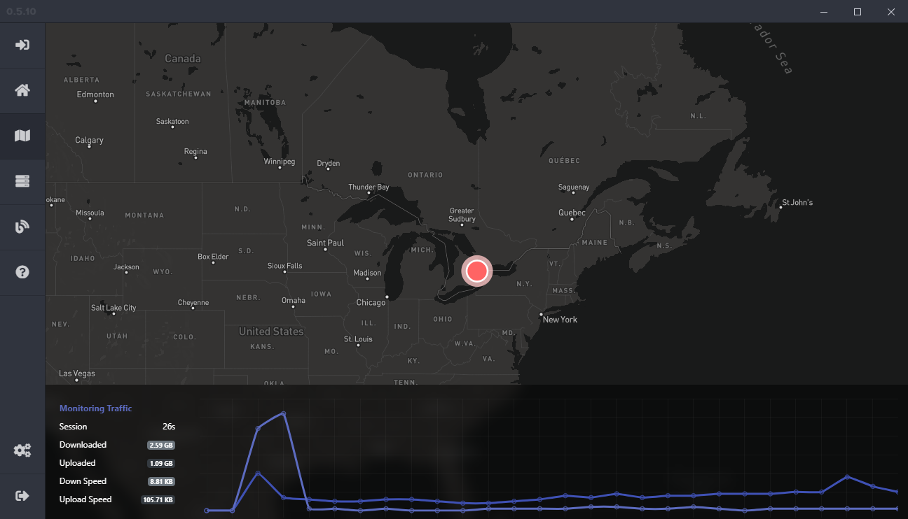

# Exordium (Desktop)
*A project by the Exordium Development Team.*

Exordium is a virtual private networking software in the works. **Our goal is to donate all profits made from the VPN towards environmental protection, and to fight against the climate crisis.** 

We hope to share as much of our programming as open source code to help others create their own projects and further the development of software built with `electronjs` and` nodejs`, which are the fundamental pieces to us. 

## 0.5.10

We are currently in the `0.5.x` development versions of the Exordium application. Download the [latest release here](https://github.com/exordium-dev/exordium/releases/latest)!

The current version of the Exordium project has come a long way and we will continue to build on and improve its features and design. Thanks to all those who have helped us build on the foundation.

### Features

Exordium is currently in the developmental version of `0.5.x`. This `README.md` was last updated during `0.5.10`. The following are current features that are offered in Exordium;

- `electron-updater` automatically checks for new updates at launch. If there is a new update available it sends a notification and askes for user verification before downloading and installing the new update. This feature also displays `download-progress`.
- `discord-rpc` shows the connection status of the current user. This feature will be able to be disabled from the settings but as of `0.5.10` this feature has not yet been implemented.
- `electron-theme-aware` was originally implemented in `0.4.x` of the application, `electronjs` has now added internal support so this function has been removed until we add the internally supported code. Should be added in after the release of `0.5.10`.
- `electronjs internet online/offline` gives notifications to the user on whether or not the computer, or application, currently has access to the public internet. Crucial in its ability to connection to the eventual vpn services.
- `fontawesome pro 5.12.1` is currently used throughout the application to give the user a better visualization towards what different buttons and functions throughout the application do.
- `animate.css` allows smooth and visually nice animations to the way pages are changed, and certain elements appear. We strive to make this application as modern and visually pleasing as possible.
- `boostrap-4` is the default framework used throughout the application.

## Issues & Suggestions

If you run into an issues regarding the application, feel free to open [an issue](https://github.com/exordium-dev/exordium/issues) so we can work together and resolve it. You can also contact us through our [discord server](https://discord.exordium.dev/), or [emails](mailto:contact@exordium.dev).

## Contact Us

If you need to get in contact with our development team or customer support, please either [join our discord server](https://discord.exordium.dev) or visit [our contact page on our website](https://exordium.dev/contact).

If you want to send us an email, regarding any issue, you can send an email to:
- :envelope: [contact@exordium.dev](mailto:contact@exordium.dev)

## Contributors

The following contributors have either helped to start this project, contributed code, or are actively maintaining it (including documentation, and creating issues), or are in some other way being awesome contributors to this project and we would like to take a moment to recognize them.

The Exordium development team:

